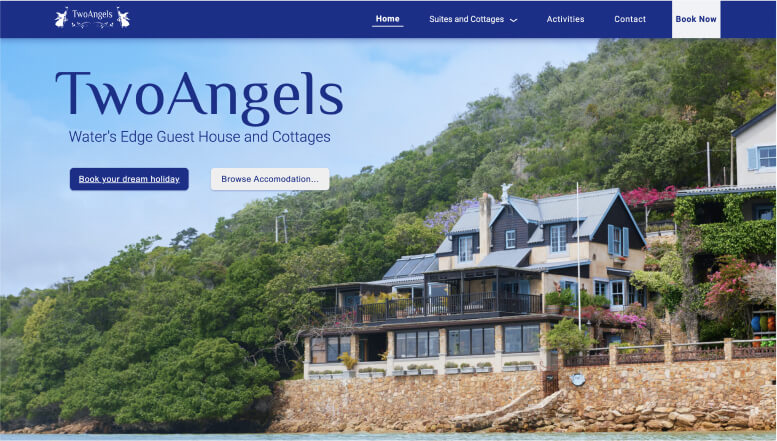

# TwoAngels

## Table of contents

- [Overview](#overview)
- [Project links](#links)
- [Development](#development)
- [What I learned](#what-i-learned)
- [Issues](#issues)
- [Acknowledgments](#acknowledgments)
- [Author](#etienne-desfontaines)

## Overview

A marketing website for a seaside guest house and its accompanying cottages in Knysna, South Africa. It focuses on using compelling language and alluring imagery to entice users to book their dream holiday. And it provides a convenient means for visitors to browse accomodation offerings and make inquiries. A truly beautfiul destination - have a look and book your dream holiday today.

### My Roles:

- Design
- Art Direction
- Copywriting
- Development

### Links

- [Live site URL](https://twoangels.co.za/)

## Development

### Technologies Used:

- HTML5
- CSS3
- Sass
- JavaScript
- jQuery

### My process

This documentation only concerns itself with my development process in this project, not the other roles I was responsibe for.

I began by outlining the minimum viable product and setting the steps necessary to accomplish it against a calendar leading to the project deadline. I then embarked on the build, following that outline as closely as was possible.

#### HTML structure

I started this build with the HTML, creating each page and populating it with its content, prior implementing any styling or functionality.

I considered the HTML from two angles:

- Semantically to increase accessibility and aid search engine optimisation.
- Structurly, to ensure that it made implementing the design as easy as possible.

#### CSS styling

I used Sass partials to structure my styling. Beginning with global styles (those affecting various HTML elements site wide), and moving onto page specific declarations, I approached each page from top to bottom. I found this method helped compartmentalise and simplify the styling process.

#### Functionality

I implemented all functionality once the static site was established. Being predominantly a display site, the bulk of the work was in the styling, but necessary functionality included:

- Operation of the image carousels
- Data Submission handling for the contact page.
- Transactional email handling for user inquiries.
- Hamburger menu functionality and animation.
- Populating the home page with different accommodation cards depending on whether or not the user's device is mobile.
- lazy loading images
- navigation signifiers

## What I learned

### Mobile first approach is better

I sadly designed and built this site following a desktop-first approach. Needless to say, it made the process far more challenging and frustrating than would otherwise have been the case, and has resulted in some remaining issues.

I now recognize why mobile-first is so important - gaining, rather than losing screen real estate makes all of the difference.

### Image Optimisation

Always optimise images in both dimension and file size.
Consider serving images based on device to allow mobile device images to be as small as possible.
Whenever possible, specify images sizes rather than using declarations of percentage or auto - this helps improve loading time, CLI and LCP.

### SEO

- Semantic HTML
- Hierarchy
- HTML Head: Title tag and meta tags with keywords and description.
- Image alt text
- File and Image naming
- Cumulative Layout Shift (CLS)
- Largest Contentful Paint (LCP)
- First Input Delay (FID)

### Naming Conventions

I initially styled the site using complex CSS selectors, which successfully achieved the desired result, but I quickly realized that the result was drastically reduced readability and, as a result, decreased ease in maintainability, especially for other developers. So I went through the very frustrating and arduous task of reimplementing all styling using BEM (Block Element Modifier). And now appreciate the importance of naming conventions and writing easy to read, understand and maintaine code.

### Netlify functions

- I learnt to create and utilise netlify functions, namely for data submission handling.

- Enviromental variables and keeping API keys secure.

### Domain

    - Configuring external DNS for a custom domain.
    - Configuring an apex domain.

### jQuery

I used a jQuery library for the websites touch swipe functionality.

### Security

- It's necessary to use rel="noreferrer noopener" on a tags with an attribute of target="\_blank" to prevent tabnabbing and phishing attacks.

### Other:

- creating and sending transactional emails (api call to email client).
- async await
- creating package.json file
- Installing and using node packages

## Issues

### Speed

The site still slower than I would like, I believe namely due to image loading. I am uncertain how to further optimise.

Cosiderations:

- webP images
- Removing gradiets from code and applying directly to images
- Using webpack to optimise site deployment.

### Responsiveness

- Small laptops and low-res screens are reading as tablets/mobile. This is the result of building desktop-first, poor use of media queries utilizing max-height and orientation, and isMobile specification not being complex enough.

I believe I know how to fix it, I just need to make the time.

Ideally, I would like to restyle - mobile first - but I do not currently have time for that.

- A function to update isMobile when screen size changes is needed. Currently, the page needs to be refreshed after screen size changes to render mobile components.

### Other:

- Using text-shadow for the bold hover state in the Nav bar, but would prefer to use an actual bold font and implement a solution to prevent layout shift. The solutions I tried weren't working, and I couldn't afford to allocate more time to this at this point.

- Both homePage.js and hamburgerMenu.js have temporary solutions for isMobile.

## To Do

### Refactor:

- Separate @media query styles into appropriate style sheets.

- Use CSS mixins and variables to reduce any unnecessary repetition.
- Consider creating a folder for HTML files.
- Address carousel logic repetition.

- Create components for reusable elements (time permitting).

- Add a variable for 6.4 rem - adjust other variables so they make sense in size order and name.

### Other:

- sitemap (XML)
- Security

  - Mobile "Book Now" button, invisible after use. This is due to hover state (wrap in media query).

  - Add TabIndex for all nav items.

  - Implement a more effective device detection method or utilize an appropriate library.

## Acknowledgments

My Brothers, Emile and Bastien Desfontaines, both of whom were invaluable in guiding me and helping me successfully tackle the design and development challenges of this project.

## Etienne Desfontaines

- Linkedin - [Etienne Desfontaines](https://www.linkedin.com/in/etienne-desfontaines-818349284/)

- Website - [Etienne Desfontaines](https://etiennedesfontaines.com/)

- Frontend Mentor - [@etiennedesfontaines](https://www.frontendmentor.io/profile/etiennedesfontaines)

- Exercism - [Etienne Desfontaines](https://exercism.io/profiles/etiennedesfontaines)
